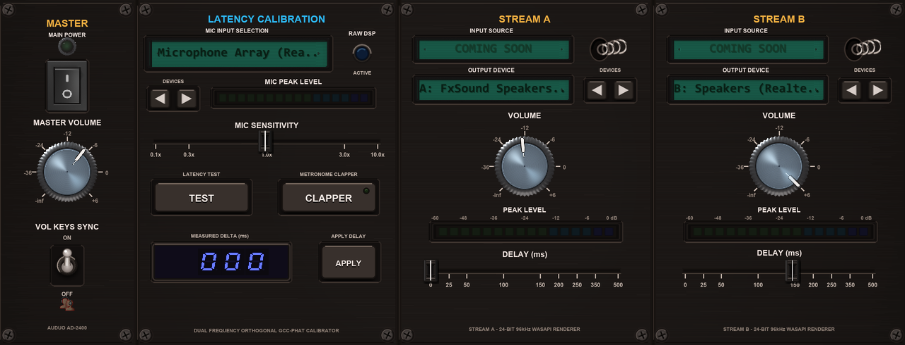

<div align="center">


# AuDuo

### Dual Audio Output & Sync for Windows



*Play your PC audio through two pairs of headphones or speakers at the same time, with easy delay calibration so both stay in sync.*

[](LICENSE)
[-0078D6.svg?logo=windows)](https://microsoft.com/windows)
[](https://en.cppreference.com/w/cpp/20)

[Features](#features) •
[Getting Started](#getting-started) •
[How It Works Under the Hood](#how-it-works-under-the-hood) •
[Lightweight by Design](#-lightweight-by-design) •
[Building from Source](#building-from-source) •
[Acknowledgements](#acknowledgements) •
[Support & Donations](#support--donations) •
[License](#license)

</div>

---

## Why AuDuo?

When watching a movie or listening to music with someone on the same Windows PC, you might want to use two pairs of headphones (or one pair of Bluetooth headphones and regular speakers).

By default, Windows doesn't allow streaming audio to two separate playback devices at once. It is literally impossible out of the box. Even if you manage to route sound through third-party virtual audio cables, Bluetooth headphones introduce natural wireless latency, creating a jarring echo or lip-sync mismatch where one listener hears the sound noticeably behind the other.

**AuDuo** solves both problems: it captures your computer's audio and streams it to two separate devices simultaneously, letting you calibrate or adjust the delay on one stream so both listeners hear the sound in perfect sync.

---

## Features

- **Built Completely in Modern C++:** 100% native C++20 desktop application—no Electron, no web views, and no heavy runtime dependencies.
- **Dual Device Playback:** Stream audio to two output devices simultaneously (Bluetooth headphones, wired headsets, or external speakers).
- **Auto-Sync Calibration:** Play quick test sounds and use your laptop or webcam microphone to automatically measure the delay between devices and sync them up.
- **Manual Delay Adjustment:** Fine-tune audio delay (0–500 ms) using a simple slider.
- **Sync Clapper:** Trigger a periodic click sound to easily check by ear if both headphones are aligned.
- **Independent Volume Controls:** Set separate volume levels for each listener, plus a master volume control.
- **Hardware Volume Sync:** Adjusting master volume stays in sync with your keyboard's volume keys and Windows taskbar slider.
- **Live Audio Meters:** Simple VU meters show audio playback activity in real time.
- **Remembers Your Settings:** Saves your selected devices, volume levels, and sync offset so you don't have to reconfigure them every time.

---

## Getting Started

### Requirements
- Windows 10 or Windows 11 (64-bit)
- Two connected audio output devices (e.g. Bluetooth headphones, USB headset, 3.5mm jack)

### Quick Guide
1. Launch `auduo.exe`.
2. Select your first device under **Stream A** and your second device under **Stream B**.
3. Turn the **Power** switch on.
4. Play any audio on your computer.
5. If one device lags behind the other:
   - Click **Chirp** to automatically detect and correct the delay using your mic, or
   - Adjust the delay slider manually until both devices match.
   - Click **Clapper** anytime to play a click sound and verify alignment by ear.

---

## How It Works Under the Hood

AuDuo is designed to duplicate and synchronize audio with low CPU overhead and no added driver bloat:

```
                        ┌─────────────────────────────────┐
                        │      WASAPI Loopback Capture    │
                        │    (System Audio Master Stream) │
                        └────────────────┬────────────────┘
                                         │
                    ┌────────────────────┴────────────────────┐
                    ▼                                         ▼
         [ Stream A: Device 1 ]                    [ Stream B: Device 2 ]
         (e.g., Wired Headphones)                  (e.g., Bluetooth Headset)
                    │                                         │
                    ▼                                         ▼
            [ Linear Resampler ]                      [ Linear Resampler ]
                    │                                         │
                    ▼                                         ▼
            [ Volume Control ]                         [ Circular Buffer ]
                    │                               (Configured Delay: 0-500ms)
                    │                                         │
                    │                                         ▼
                    │                                  [ Volume Control ]
                    │                                         │
                    ▼                                         ▼
            [ Output Client A ]                       [ Output Client B ]
```

### 1. Loopback Capture (WASAPI)
AuDuo hooks into the Windows Audio Session API (WASAPI) in loopback mode. This grabs the mixed audio output coming from your active applications without needing a virtual soundcard or physical splitter cable.

### 2. Sample Rate Matching
Different devices often run at different sample rates (for example, one at 44.1 kHz and another at 48 kHz). AuDuo resamples the audio stream on the fly so each device gets clear, properly pitched audio without glitches.

### 3. Circular Delay Buffer
To fix the timing difference between fast devices (like a wired jack) and slower devices (like Bluetooth), AuDuo feeds Stream B through a circular memory buffer. This buffer holds the audio for a configurable amount of time (0 to 500 ms) before sending it to the second device, delaying the faster device so it matches the slower one.

### 4. Acoustic Auto-Calibration
When you press the **Chirp** button, AuDuo outputs two distinct audio frequencies—one through Device A and one through Device B. It then listens through your default microphone, detects the arrival time of each sound, calculates the exact difference in milliseconds, and sets the delay buffer automatically.

### 5. Windows Volume Integration
AuDuo registers an audio endpoint volume callback with Windows. When you press volume up/down keys on your keyboard, AuDuo detects the change and adjusts its master volume to match.

---

## ⚡ Lightweight by Design

- **Single < 4 MB executable** with zero background services or telemetry.
- **Bare-metal C++20 and WASAPI** with direct memory streaming.
- **< 0.5% typical CPU usage** during active playback.

---

## Building from Source

### Prerequisites
- Windows 10 or 11 (x64)
- A C++20 compatible compiler toolchain with `make` (e.g. GCC / MinGW-w64 via [w64devkit](https://github.com/skeeto/w64devkit))
- Git

### Build Instructions
Clone the repository:
```powershell
git clone https://github.com/AivinKoshy/auduo.git
cd auduo
```

Build the project using `make` (adjust path if using your own MinGW / w64devkit installation):
```powershell
make
```

The executable will be created at `bin\auduo.exe`.

---

## Acknowledgements

AuDuo is made possible thanks to these excellent open-source projects and audio drivers:

- **[VB-Audio Virtual Cable](https://vb-audio.com/)** by Vincent Burel — loopback routing and virtual audio bridging on Windows. Special thanks for their brilliant contributions to Windows digital audio!
- **[Dear ImGui](https://github.com/ocornut/imgui)** by Omar Cornut — immediate mode GUI library for C++.
- **[w64devkit](https://github.com/skeeto/w64devkit)** by Chris Wellons — portable C and C++ development kit for x64 Windows.

---

## Support & Donations

If AuDuo helped you share movies, music, or gaming sessions without audio sync issues, consider supporting the project:

- 💖 **[Support AuDuo & Donate](https://aivinkoshy.github.io/auduo/donate/)** (UPI & International Payment Options)
- ⭐ Star the repository on GitHub to help others find it!

---

## License

This project is open-source under the [GNU General Public License v3.0 (GPLv3)](LICENSE).
